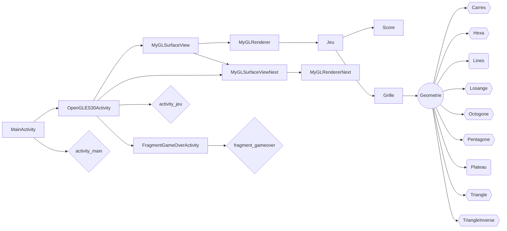

SAGET
Margot
o2172771

[github](https://github.com/margototoo/CinqOuPlus/)

# Cinq ou plus

## Scénario d'utilisation :

- Appuyer sur le bouton 'Jouer'
- Appuyer sur le bouton 'Start'
- Jouer en déplaçant les formes, pour former des lignes et gagner des points
- Un fois la grille rempli entièrement, la partie est terminée

## Architecture du code :

Le code commence tout d'abord par afficher une activité XML, qui va afficher l'écran d'accueil.
On se dirige ensuite vers la page XML du jeu, qui va afficher l'initialisation du score tout en haut, l'initialisation de la view **MyGLSurfaceViewNext** et de la view **MyGLSurfaceView**, et enfin un bouton 'Start'.
Une fois qu'on a appuyé sur le bouton 'Start', la classe **MyGLSurfaceView** va appeler **MyGLRenderer**, qui va afficher un nouveau plateau, une nouvelle grille, 3 nouvelles formes et démarrer le jeu. Cette  classe communique avec le **MyGLSurfaceViewNext**, pour lui informer des prochaines formes qui vont apparaître.
Les classes **Grilles** et **Jeu** vont communiquer entre elles, pour gérer les déplacements possibles et afficher les formes (qui sont appelés grâce à l'interface **Geometrie**).
Au fur et à mesure de la partie, on vérifie si le joueur fait des lignes et on actualise son score.
Pour la fin, on vérifie si la grille est pleine et on affiche un texte qui nous indique que la partie est terminé.

## Problème :

La création de la page d'accueil n'est pas très utile dans notre cas, mais par la suite, on pourra aussi ajouter un bouton pour gérer les paramètres de l'application et du jeu.
Pour afficher la grille, j'ai utilisé des lignes, qu'on peut retrouver dans la classe **Lines**. Mais elles ne sont pas assez visibles. Je n'ai pas réussi à trouver un moyen de donner une plus grosse épaisseur au trait, donc pour bien les afficher, on est obligé de zoomer
sur l'émulateur.
L'affiche est correcte sur une tablette mais la partie OpenGl n'est pas fonctionnelle car quand on touche la grille, on utilise les coordonnées de la vue.
Une fois la partie terminée, je voulais afficher un pop-up, grâce a un fragment, pour afficher le résultat et pour pouvoir retourner vers le menu. Mais l'actualisation de l'**OpenGLES30Activity** ne se fait pas automatiquement. Par exemple, pour l'affichage du score, on fait un appel de l'activité dans le **MyGLSurfaceView**, et ce score est une variable static. Mais le **fragment_gameover** ne peut pas être static.

- Téléphone utilisé :
   > Api : 32
   > Résolution : 1080 x 2340
   > dp : 393 x 851
   > device name : pixel_5

### Schéma très simplifié de la réprésentation des classes :

